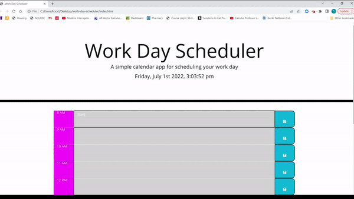

# Third-Party APIs: [Work Day Scheduler]()

This is a web application hosting a daily planner. The user may select any time between 8:00 AM to 7:00 PM, and from the time blocks enter an event from within. By clicking on the button on the right, the user may save the events so that the events labeled will persist even if the page were to be refreshed.

## Tools Used

This planner was made using javascript hosting on an HTML web application. As the title may have indicated, a variety of third-party APIs have been incorporated in order to help with the formatting and styling, especially the Bootstrap templates.

The following is a sample of the code.

```
// Saving events
$(".saveBtn").click(function (event) {
    event.preventDefault();

    var desc = $(this).siblings(".description").val();
    var hour = $(this).parent().attr("id").split("-")[1];

    localStorage.setItem(hour, desc);

});
```

At first glance, the above snippet may not seem special in any way. However, the queries used to call upon the specific DOM elements were a product of hours of research and trial-and-error in other to get the local storage functions working for the site. Especially when it comes to experimenting with different selectors, and see how they correspond to each query or what sort of extensive rewrites are necessary for the function.

## Mock-Up

The following image shows the web application's appearance:


The following image shows the web application's functionality:



- - -
<p>© 2022 Clement Koo<br></pr>

[LinkedIn](https://www.linkedin.com/in/clement-t-k-459322138/)
<br>

[Portfolio](https://c-k999.github.io/proto-professional-portfolio/)
